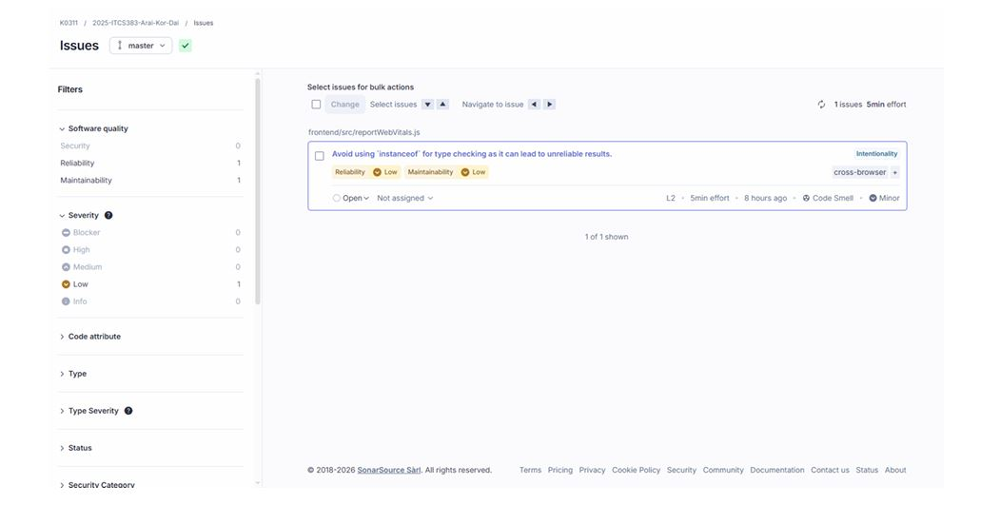
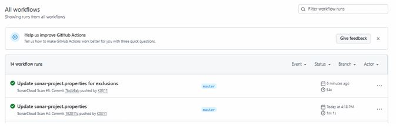
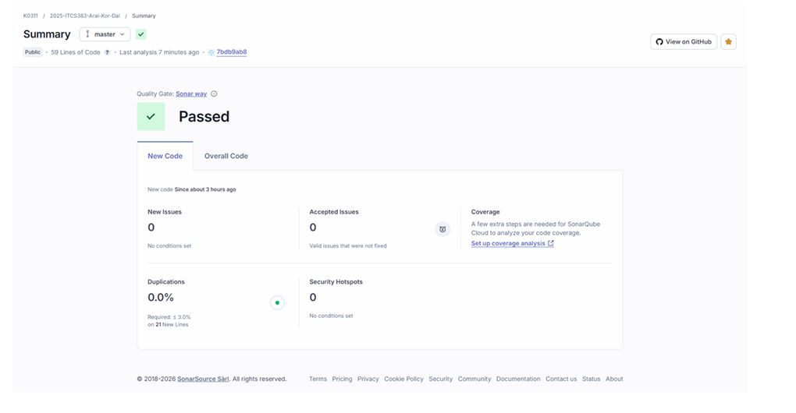

# D4: Quality Evidence Report

## Presented by

- 6688046 Warut Khamkaveephart
- 6688194 Muhummadcharif Kapa
- 6688083 Teeramanop Pinsupa
- 6688148 Bunyakorn Wongchadakul
- 6688205 Sirawit Noomanoch
- 6688226 Thanawat Thanasirithip

---

# Introduction

This report provides evidence of the software quality analysis performed on the project using a static code analysis tool in **SonarQube / SonarCloud**.

The purpose of this report is to demonstrate that the software project meets the required quality standards and passes the automated quality checks.

---

# Quality Gate Result

The analysis results indicate that the project successfully **passed the SonarCloud Quality Gate**.

This confirms that the project meets the predefined code quality standards including:

- No critical code issues
- No blocker issues
- Acceptable code reliability
- Maintainability standards

---

# GitHub Actions

The project integrates **GitHub Actions** to automatically run quality checks during the development workflow.

GitHub Actions ensures that:

- Code analysis runs automatically
- Quality checks are enforced
- Continuous integration is maintained

---

# SonarCloud Analysis

# Code Quality Result

The static analysis results from SonarCloud show the following:

- **Blocker Issues:** 0  
- **High Severity Issues:** 0  

The project successfully **passed the SonarCloud Quality Gate**.

Screenshots of the analysis summary and severity breakdown are included in the report.

---

# SonarCloud Project Link

SonarCloud dashboard for the project:

https://sonarcloud.io/project/overview?id=K0311_2025-ITCS383-Arai-Kor-Dai

---

# Conclusion

Based on the SonarCloud static code analysis results, the project meets the required code quality standards.

The absence of blocker and high severity issues demonstrates that the codebase maintains a good level of reliability and maintainability.

Continuous integration through GitHub Actions further supports automated quality assurance throughout the development process.