# HANDOVER.md — Post Office Online Shipping System (Arai-Kor-Dai)

**Handover Received By:** Team Emerald
**Date:** 2026-03-24
**Original Team:** Arai-Kor-Dai (6688046, 6688194, 6688083, 6688148, 6688205, 6688226)

### Team Emerald Members

| Student ID | Name |
|------------|------|
| 6688139 | Naruebordint Veangnont |
| 6688141 | Rattee Watperatam |
| 6688155 | Nattaphong Jullayakiat |
| 6688164 | Veerakron No-in |
| 6688172 | Wirunya Kaewthong |
| 6688239 | Piyada Chalermnontakarn |

---

## 1. Project Features

The Post Office Online Shipping System is a full-stack web application for Thailand Post that allows customers to prepare parcels and letters online before visiting a branch. Below is a summary of every feature received in the handover.

### 1.1 Customer Features

| Feature | Description |
|---------|-------------|
| **User Registration (FR-01)** | 3-step registration flow: personal info, contact details, account setup. National ID upload and selfie holding ID card for KYC verification. |
| **Account Verification (FR-02)** | Admin manually reviews uploaded ID documents and selfie, then approves or rejects the account via the User Approval page. |
| **User Login (FR-03)** | Email + password authentication with bcrypt hash comparison. Separate user/admin login tabs. Password show/hide toggle and form validation. |
| **Create Shipment (FR-04)** | Multi-section form: sender info, receiver info, package type (Parcel/Letter/Express/Registered), service level (Standard/Priority/Same Day), dimensions, weight, contents, declared value, special handling (Fragile/Keep Cold), and insurance toggle. |
| **Shipping Cost Calculation (FR-05)** | Automatic price calculation based on weight, distance, and service level via the Logistics component. |
| **Insurance Option (FR-06)** | Optional toggle switch on the Create Shipment page; premium computed from declared item value. |
| **Online Payment (FR-07)** | Three payment methods: PromptPay, Credit Card, and TrueMoney e-wallet. Payment is processed and recorded in the `payments` table. |
| **Shipping Label Generation (FR-08)** | Client-side PDF generation (A6 size) with QR code and tracking number using jsPDF. Downloaded directly after payment confirmation. |
| **Parcel Tracking (FR-09)** | Search by tracking number (e.g., TH-2024-0089). Displays status timeline, origin, destination, recipient, ETA, and last update. |
| **Transaction History (FR-10)** | Full shipment history with sender/receiver info and payment details. Filterable by date and status. |

### 1.2 Admin Features

| Feature | Description |
|---------|-------------|
| **Admin Statistics Dashboard (FR-11)** | KPI cards (total parcels, revenue, pending users). Chart showing parcel volume by day/week/month. |
| **Revenue Report (FR-12)** | Stacked bar chart (shipment types over time), revenue line chart with area fill, type breakdown table, and top routes table. |
| **Report Export (FR-13)** | PDF export via jsPDF + autoTable. Includes red cover page, CONFIDENTIAL footer, page numbers, and auto-pagination. |
| **User Approval (FR-02)** | Queue of pending KYC submissions with ID photo and selfie preview. Approve/Reject actions. |

### 1.3 Non-Functional Requirements

| NFR | Requirement | Implementation |
|-----|-------------|----------------|
| NFR-01 | 99.999% Uptime | Deployed on Vercel (frontend) and Render (backend) |
| NFR-02 | <1s Response Time | MySQL indexed queries on `tracking_number`; lightweight REST API |
| NFR-03 | Security | Bcrypt password hashing (10 rounds), parameterized SQL queries, HTTPS, CORS |
| NFR-04 | Usability | Responsive React UI with TailwindCSS, form validation, clear navigation |
| NFR-05 | Branding | Thailand Post red (#E60012) + white color scheme throughout |

### 1.4 Feature Evidence Screenshots (D1 — System Running)

The following screenshots demonstrate the system running successfully on the local machine.

> **System Status:**
> - Backend: http://localhost:3000 (API verified, returning data)
> - Frontend: http://localhost:3001 (serving React app)
> - Database: `postoffice` with 5 tables seeded
> - Login: `SomchaiJ@gmail.com` / `Pass1234`

#### Customer Features

**User Login**

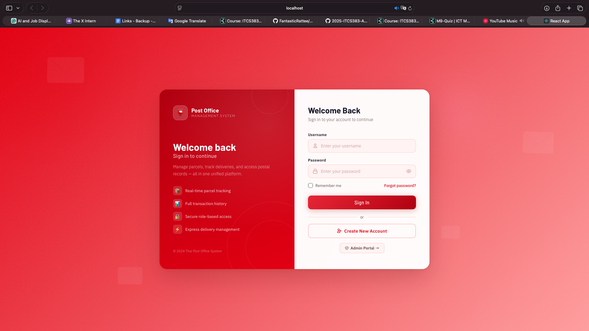

**Dashboard**

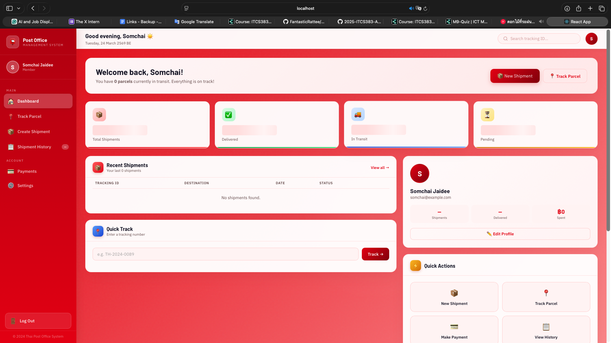

**Create Account (Registration)**

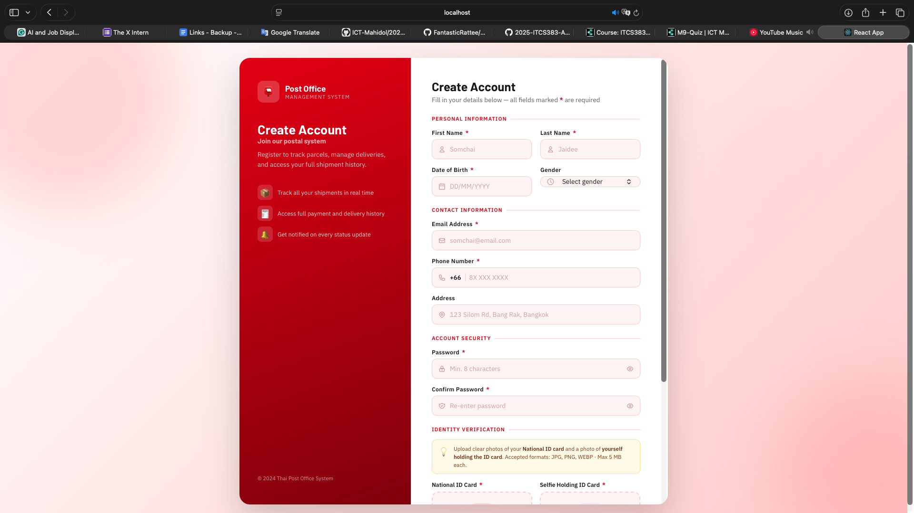

**Create Shipment & Shipping Cost Calculation**

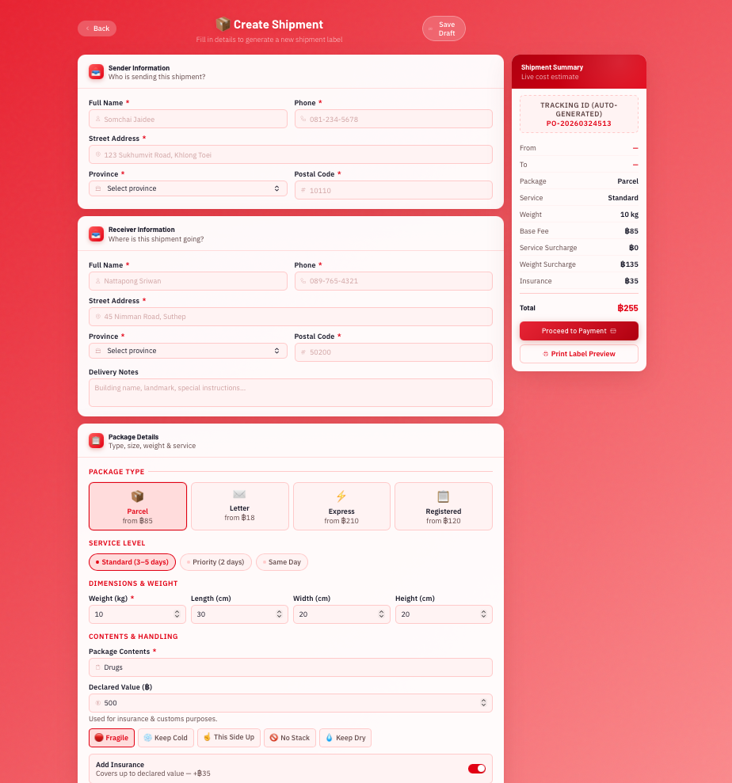

**Insurance Option**

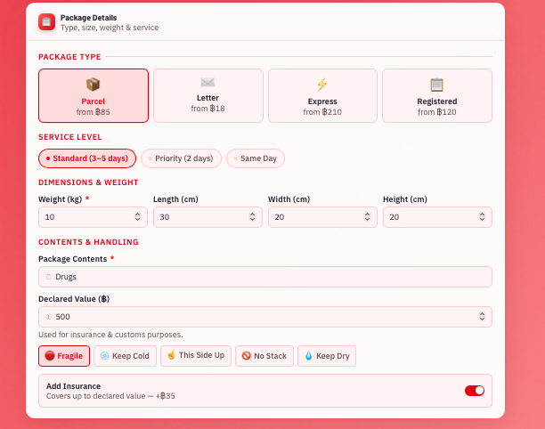

**Online Payment**

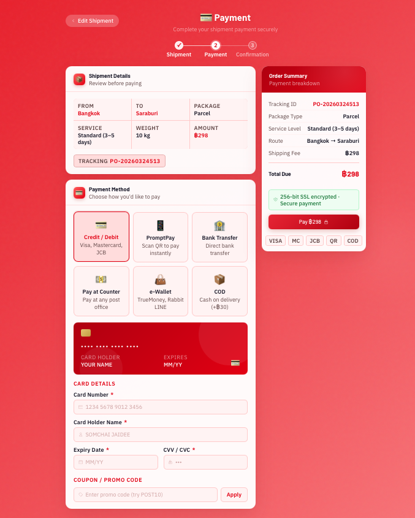

**Payment Done**

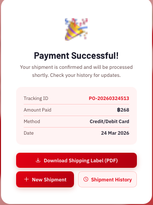

**Shipping Label Generation**

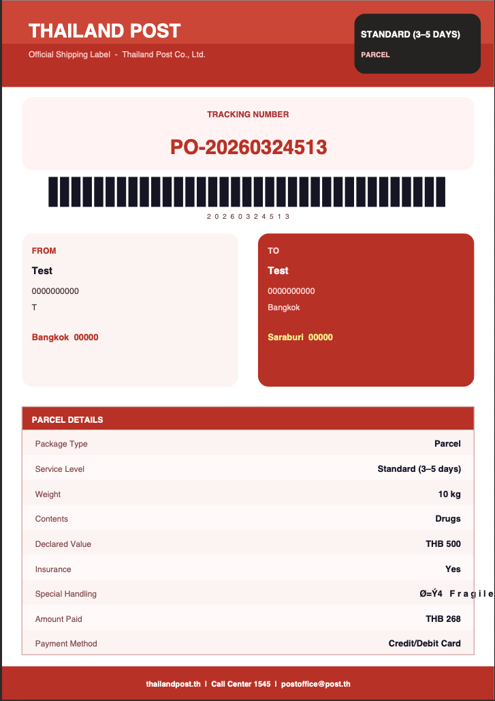

**Parcel Tracking**

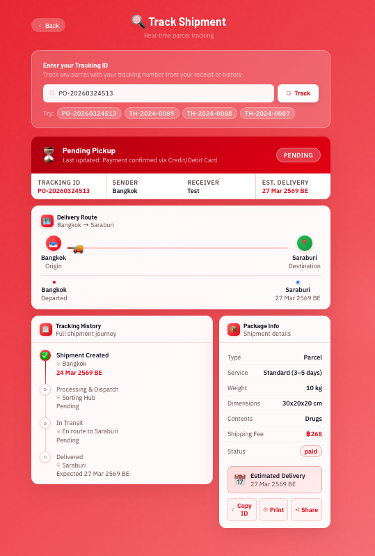

**Transaction History**

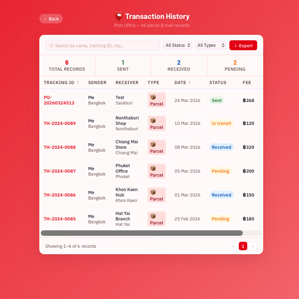

#### Admin Features

**Admin Login**

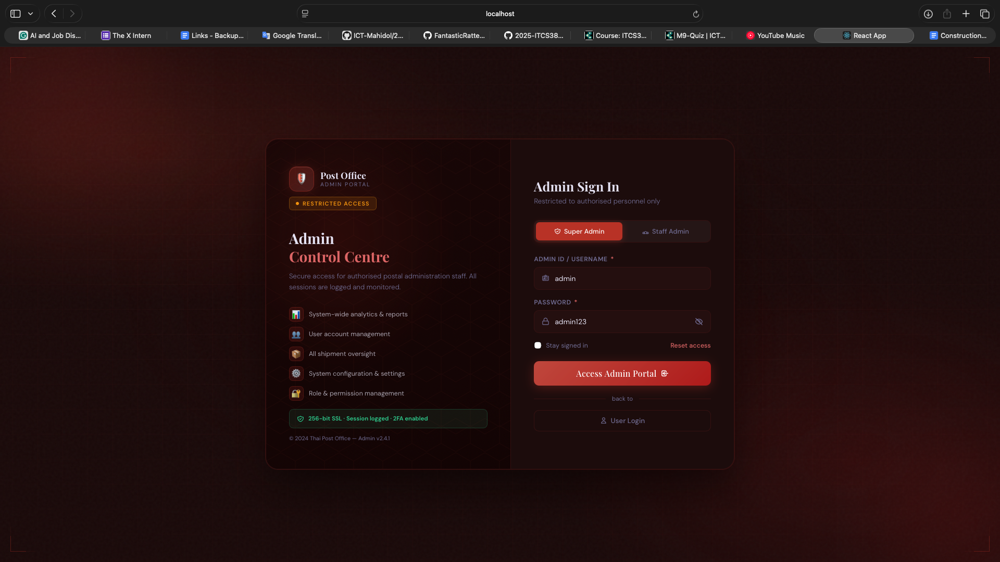

**Admin Verify (2FA)**

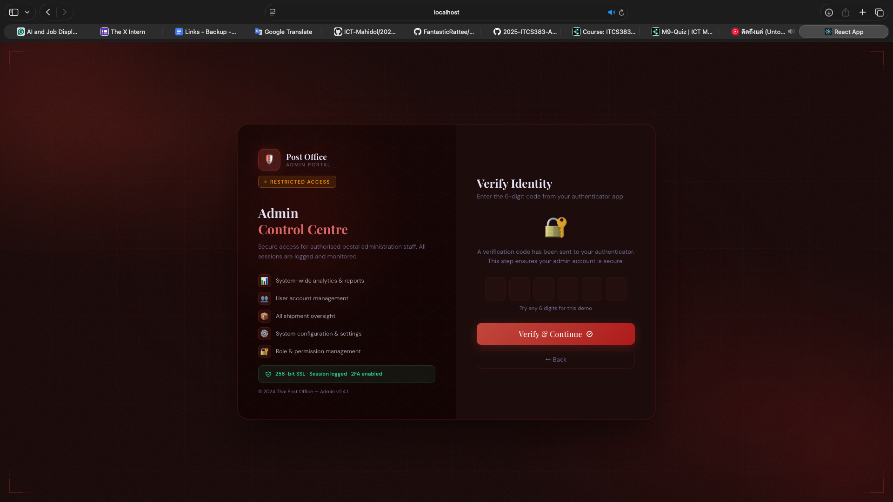

**Login as Super-Admin**

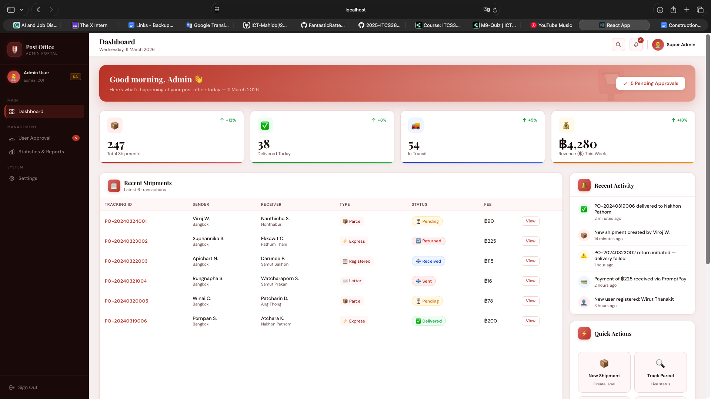

**Login as Staff Admin**


**Admin Statistics Dashboard**

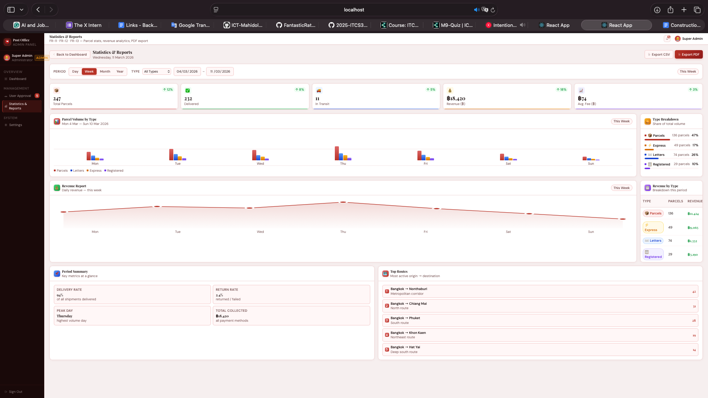

**Admin - Export Report Option**

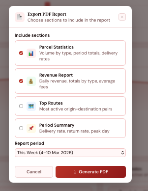

> **Note:** Admin Export PDF feature is **not working** in the current implementation.

**Admin - User Approval**

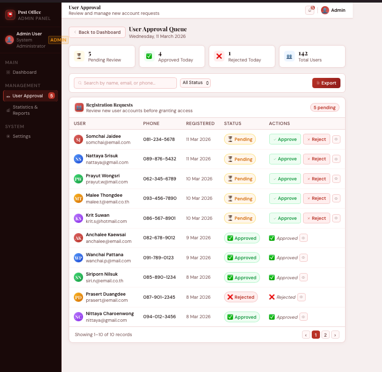

---

## 2. Design Verification — C4 Diagrams vs. Actual Implementation

### 2.1 C4 Context Diagram

| Design Element | Design Description | Implementation | Consistent? |
|----------------|-------------------|----------------|-------------|
| **Post Office Management System** | Core system managing shipments, payments, and tracking| Implemented: FrontendPage (LoginPage, CreateShipmentPage, etc.) and backend services | **Yes** |
| **Customer** | Registered user who creates shipments, pays, and tracks parcels | Implemented: LoginPage, RegisterPage, CreateShipmentPage, PaymentPage, TrackingPage | **Yes** |
| **Post Office Staff**  | Internal officers who verify identity and review reports | Implemented: AdminLoginPage, AdminDashboardPage, AdminReportsPage, UserApprovalPage | **Yes** |
| **Bank System** [external] | Handles PromptPay, Credit Card, TrueMoney payments | Stripe is listed as a dependency. Payment flow is currently mocked/simulated, which is acceptable for development. | **Yes** |

#### Some relationships in the diagram are unclear or have no label. Improvements were made by adding clear interaction labels and removing unclear connections.

### 2.2 C4 Container Diagram

| Container (Design) | Implementation | Consistent? |
|---------------------|----------------|-------------|
| **Frontend (Web Application)** | React 19 SPA with TailwindCSS, served on port 3001 | **Yes** |
| **Backend (API Server)** | Node.js + Express 5 on port 3000, multiple route files | **Yes** |
| **Post Office Management** (separate container) | **Not separate** — Admin pages are part of the same React frontend and use the same backend API. No distinct container. | **No** — Design shows a separate container, but implementation merges admin into the main frontend/backend. |
| **Bank System (External)** | Stripe dependency exists in package.json. Payment is currently mocked, which is acceptable for development. | **Yes** |

#### Container diagram includes more details than necessary and mixes container-level and component-level elements. Some parts, such as the Post Office Management

### 2.3 C4 Component Diagram

| Component (Design) | Mapped Implementation | Consistent? |
|---------------------|----------------------|-------------|
| **Frontend/Backend (Core API)** | `server.js` with route files handle routing, authentication (bcrypt), and CORS | **Yes** |
| **Shipping Service** | `routes/shipments.js` — POST /api/shipments creates shipments with type, weight, dimensions, label data | **Yes** |
| **Payment Service** | `routes/shipments.js` — payment handled within in shipment creation transaction. No separate payment route file. | **Partial** — Design shows isolated Payment Service, but payment logic is embedded in the shipment creation endpoint. |
| **Logistics Service** | Price calculation performed **client-side** in CreateShipmentPage.jsx, not in a dedicated backend component. | **No** — Design shows a backend Logistics Service, but implementation does pricing on the frontend. |
| **Tracking Store Service** | `routes/shipments.js` — GET /api/shipments/track/:trackingNumber | **Yes** — tracking is served from the shipments table. |
| **Office Service** | `routes/users.js` — GET /api/user/stats/:id for dashboard stats. Admin reports generated client-side via jsPDF. | **Partial** — Stats endpoint exists, but PDF report generation is client-side, not a backend service. |

#### Some components in the design are not fully separated in the implementation. For example, payment logic is combined with shipment creation, and price calculation is handled on frontend not in backend service. Some component names and boundaries are also unclear or inconsistent.

### 2.4 Usecase Diagram 
The system boundary is not labeled, making it unclear what system the use cases belong to. A clear system name should be added.

### 2.5 DFD Level 1 — Process Verification

| Process (Design) | Implementation | Consistent? |
|-------------------|----------------|-------------|
| P1: User Management | `routes/users.js` — register, login, profile, stats | **Yes** |
| P2: Shipment Management | `routes/shipments.js` — create, list, history | **Yes** |
| P3: Payment Processing | Embedded in POST /api/shipments (same transaction) | **Partial** — not a separate process |
| P4: Tracking Management | GET /api/shipments/track/:trackingNumber | **Yes** |
| P5: Insurance Processing | Insurance flag stored as column in shipments table | **Yes** (simplified) |
| P6: Admin Dashboard | GET /api/user/stats + client-side jsPDF reports | **Partial** |

### 2.6 Class Diagram Verification

The original class diagram (`designs/Class_Diagram_Arai-Kor-Dai.png`) defines 7 classes: **User** (parent), **Customer**, **Admin**, **Shipment**, **Receiver**, **Payment**, **Insurance**, and **Tracking**. Below is a detailed comparison against the actual database schema (`setup.sql`) and route implementations.

#### Consistencies (What Matches)

| Class / Element | Diagram | Implementation | Verdict |
|-----------------|---------|----------------|---------|
| **User → Customer / Admin** inheritance | User is parent; Customer and Admin are subclasses | `users` table with `role` column (`member`, `super-admin`, `staff-admin`) distinguishes user types | Consistent |
| **Customer methods** | `register()`, `login()`, `createShipment()`, `trackParcel()`, `viewTransactionHistory()` | All implemented in `routes/users.js`, `routes/shipments.js`, and frontend pages | Consistent |
| **Admin methods** | `approveUser()`, `viewParcelStatistics()`, `viewRevenueStatistics()`, `exportReport()` | All exist in admin pages (though `exportReport` PDF generation is broken) | Consistent |
| **Shipment → Payment** relationship | Shipment has associated Payment | `payments` table has `shipment_id` foreign key | Consistent |
| **Shipment methods** | `calculateShippingPrice()`, `generateShippingLabel()` | Both exist (implemented client-side in React) | Consistent (but client-side, not backend) |

#### Inconsistencies (What Doesn't Match)

| # | Issue | Diagram Says | Actual Implementation | Severity |
|---|-------|-------------|----------------------|----------|
| 1 | **User `firstName` + `lastName`** | Two separate String fields | DB has a single `name` VARCHAR(100) column | Medium |
| 2 | **User `userId` type** | `userId: String` | DB uses `id INT AUTO_INCREMENT` (integer, not string) | Low |
| 3 | **User missing `role` and `created_at`** | Not shown in diagram | Both exist in DB schema and are critical for the system (`role` drives authorization, `created_at` for audit) | Medium |
| 4 | **Receiver class does not exist** | Separate class with `ReceiverName`, `address`, `zipCode`, `phoneNumber` | No `receivers` table — recipient is a single `VARCHAR(100)` column on `shipments`. No zip code or phone number stored. | **High** |
| 5 | **Insurance class does not exist** | Separate class with `insuranceId`, `declaredValue`, `insurancePrice`, `calculateInsurance()` | No `insurance` table — just a `TINYINT(1)` boolean flag on `shipments`. No price calculation or declared value stored. | **High** |
| 6 | **Tracking class does not exist** | Separate class with `trackingNumber`, `location`, `status`, `updateStatus()` | No `tracking` table — tracking data is `status` + `last_update` columns directly on the `shipments` table. No event log history. | **High** |
| 7 | **Shipment missing many attributes** | Shows only: `parcelType`, `boxSize`, `weight`, `shippingPrice`, `trackingNumber`, `status` | DB also has: `service`, `dims`, `contents`, `handling`, `insurance`, `eta`, `origin`, `destination`, `recipient`, `last_update`, `created_at` — none shown in diagram | Medium |
| 8 | **Payment `status` field** | Shows `status: String` attribute | No `status` column exists in the `payments` table. Also `paymentId` is `INT`, not String. | Medium |
| 9 | **Payment missing `user_id`, `shipment_id`, `created_at`** | Not shown | All three exist in DB and are essential for linking payments to users and shipments | Medium |
| 10 | **Notifications table missing from diagram** | Not represented at all | `notifications` table exists with 6 columns (`id`, `user_id`, `message`, `type`, `is_read`, `created_at`) | Medium |
| 11 | **Activity Log table missing from diagram** | Not represented at all | `activity_log` table exists with 5 columns (`id`, `user_id`, `type`, `title`, `subtitle`, `created_at`) | Medium |

#### Class Diagram Summary

- **3 classes in the diagram don't exist as separate entities** in the implementation (Receiver, Insurance, Tracking) — their data is either a column on `shipments` or not stored at all.
- **2 database tables are completely absent** from the diagram (notifications, activity_log).
- **Attribute names and types** differ significantly (e.g., `firstName`/`lastName` vs `name`, String IDs vs INT).
- The diagram represents an **idealized design** that was significantly simplified during implementation.

### 2.6 Summary of All Inconsistencies

| # | Inconsistency | Source | Severity |
|---|---------------|--------|----------|
| 1 | Post Office Management is not a separate container — admin is merged into the main app | C4 Container | Medium |
| 2 | Payment Service is not isolated — payment logic is embedded in shipment creation | C4 Component | Low |
| 3 | Logistics Service (pricing) runs client-side, not as a backend component | C4 Component | Medium |
| 4 | Requirements document says PostgreSQL, but actual implementation uses MySQL | Requirements | Medium |
| 5 | Receiver class does not exist — recipient is just a VARCHAR on shipments | Class Diagram | **High** |
| 6 | Insurance class does not exist — just a boolean flag on shipments | Class Diagram | **High** |
| 7 | Tracking class does not exist — no event log, just status field on shipments | Class Diagram | **High** |
| 8 | User has single `name` field, not `firstName` + `lastName` as designed | Class Diagram | Medium |
| 9 | User `userId` is INT, not String as designed | Class Diagram | Low |
| 10 | User missing `role` and `created_at` in diagram | Class Diagram | Medium |
| 11 | Payment has no `status` column; missing `user_id`, `shipment_id`, `created_at` in diagram | Class Diagram | Medium |
| 12 | Shipment missing 11 attributes from diagram (service, dims, contents, etc.) | Class Diagram | Medium |
| 13 | Notifications table not represented in any design diagram | Class Diagram | Medium |
| 14 | Activity Log table not represented in any design diagram | Class Diagram | Medium |
| 15 | Report generation is client-side (jsPDF), not a backend Office Service | C4 Component | Low |
| 16 | User `accountStatus` field (pending/approved/rejected) not in schema — uses `role` only | Class Diagram | Low |


---

## 3. Reflections on Receiving the Handover Project

### 3.a Technologies Used

| Layer | Technology | Version |
|-------|-----------|---------|
| **Frontend Framework** | React | 19.2.4 |
| **Frontend Styling** | TailwindCSS | 4.2.1 |
| **Frontend Routing** | React Router DOM | 7.13.1 |
| **Backend Runtime** | Node.js | — |
| **Backend Framework** | Express.js | 5.2.1 |
| **Database** | MySQL | via mysql2 3.19.1 |
| **Authentication** | bcrypt | 6.0.0 |
| **Token (dependency)** | jsonwebtoken | 9.0.3 (listed but not actively used in routes) |
| **File Upload** | Multer | 2.1.1 (listed but KYC upload not wired in current routes) |
| **PDF Generation** | jsPDF (client-side) + PDFKit (server-side, unused) | — |
| **Payment (dependency)** | Stripe | 20.4.1 (dependency listed but not called) |
| **CORS** | cors | 2.8.6 |
| **Environment Config** | dotenv | 17.3.1 |
| **Version Control** | Git + GitHub | — |
| **CI/CD** | GitHub Actions | — |
| **Code Quality** | SonarCloud | — |
| **Hosting (production)** | Vercel (frontend) + Render (backend) | — |

**Note:** The requirements document specifies PostgreSQL, but the actual implementation uses MySQL. This is a significant deviation that should be documented.

### 3.b Required Information to Successfully Hand Over the Project

Based on my experience receiving this handover, the following information was essential:

1. **Database credentials** — The `.env` file contained the original developer's MySQL password (`Test1234`), which had to be updated to the local machine's password (`u6688141`). Without knowing to change this, the backend cannot connect.

2. **Database setup order** — The `setup.sql` file originally had `USE postoffice;` on line 1, before the `CREATE DATABASE` statement. This caused an error (`Unknown database 'postoffice'`) and had to be fixed by removing the premature `USE` statement.

3. **Port configuration** — Backend runs on port 3000, frontend on port 3001. The frontend's API calls are hardcoded to `http://localhost:3000`. This must be known to avoid CORS issues.

4. **Demo credentials** — Login email: `SomchaiJ@gmail.com`, password: `Pass1234`. Without these, you cannot test the authenticated features.

5. **Node.js and MySQL prerequisites** — Node.js (v16+) and MySQL Server must be installed locally.

6. **Missing README instructions** — The README references a live Vercel deployment but does not provide clear step-by-step local setup instructions. Local setup required:
   - Fixing the SQL setup script
   - Updating the `.env` password
   - Running `npm install` in both `implementations/backend/` and `implementations/frontend/`
   - Starting both servers manually

7. **Dual project structure** — There are route files at both the root `/routes/` and `/implementations/backend/routes/`. The root-level files appear to be legacy/duplicates. The actual working code is in `/implementations/backend/`.

8. **Unused dependencies** — Several npm packages are listed but not actively used in the codebase (Stripe, jsonwebtoken, Multer, PDFKit). This can cause confusion when trying to understand the architecture.

### 3.c Code Quality — SonarCloud Analysis

#### SonarCloud Results (New Version)

The latest SonarCloud static analysis results:

| Metric | Result |
|--------|--------|
| **Quality Gate** | Not computed |
| **Blocker Issues** | 0 |
| **High Severity Issues** | 13 |
| **Reliability** | D (329 open issues) |
| **Maintainability** | A (333 open issues) |
| **Security** | A (0 open issues) |

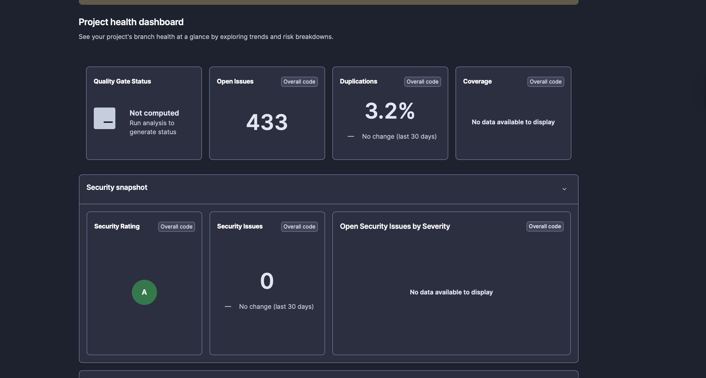 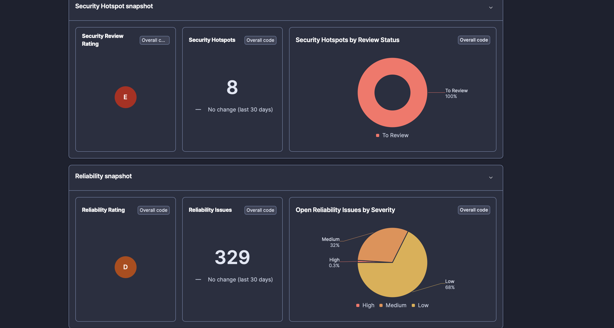 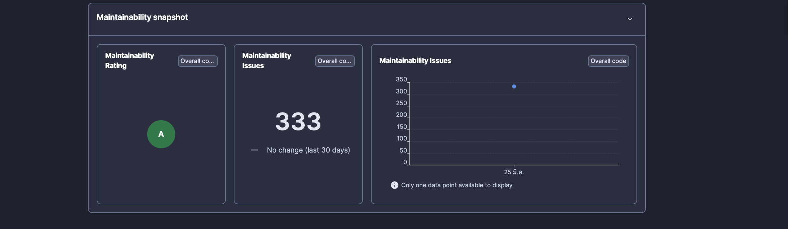 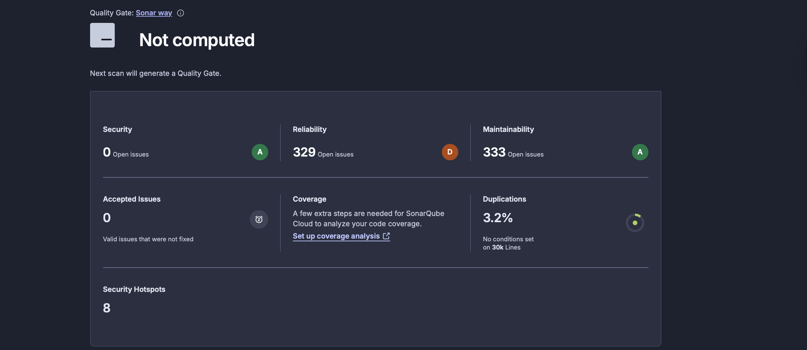 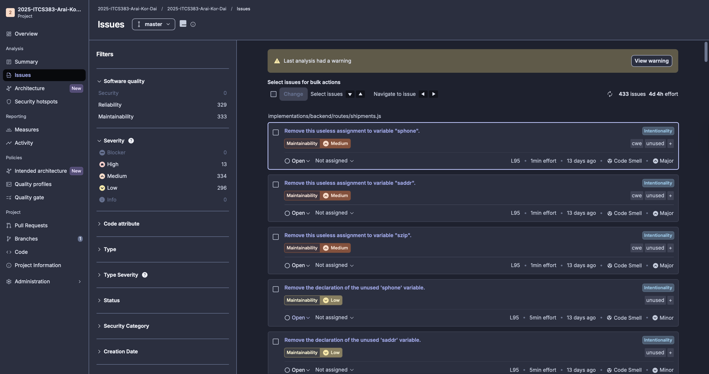
#### Manual Code Quality Observations

After reviewing the codebase, the following quality observations were made:


**Weaknesses / Areas for Improvement:**
- **Hardcoded API URLs** — Frontend has `http://localhost:3000` hardcoded in component files instead of using environment variables.
- **No automated tests** — `npm test` only echoes an error message. No unit or integration tests exist.


#### Code Metrics Summary

| Metric | Value |
|--------|-------|
| Backend route files | 4 files, ~353 lines total |
| Frontend page components | 12 JSX files |
| Database tables | 5 (users, shipments, payments, notifications, activity_log) |
| Test coverage | 0% (no tests) |
| npm vulnerabilities (frontend) | 27 (9 low, 3 moderate, 15 high) |
| npm vulnerabilities (backend) | 0 |

---

## 4. Setup Instructions (for Future Handovers)

```bash
# Prerequisites: Node.js v16+, MySQL Server

# 1. Set up database
mysql -u root -p < implementations/backend/setup.sql

# 2. Configure environment
# Edit implementations/backend/.env and set DB_PASS to your MySQL root password

# 3. Install and start backend
cd implementations/backend
npm install
node server.js
# Expected: "API running on http://localhost:3000"

# 4. Install and start frontend (new terminal)
cd implementations/frontend
npm install
PORT=3001 npm start
# Opens: http://localhost:3001

# 5. Login with demo credentials
# Email: SomchaiJ@gmail.com
# Password: Pass1234
```

---

## 5. File Structure Overview

```
2025-ITCS383-Arai-Kor-Dai/
├── README.md
├── HANDOVER.md                    (this file)
├── .env
├── designs/                       C4 diagrams, use case, class diagram, requirements
│   ├── Arai-Kor-Dai_D1_Design.md
│   ├── requirements.md
│   └── *.svg, *.png              (diagram images)
├── implementations/
│   ├── backend/
│   │   ├── server.js             Express server entry point
│   │   ├── db.js                 MySQL connection pool
│   │   ├── .env                  Database credentials
│   │   ├── setup.sql             Schema + seed data
│   │   ├── package.json
│   │   └── routes/
│   │       ├── users.js          Register, login, profile, stats
│   │       ├── shipments.js      CRUD, tracking, history
│   │       ├── notifications.js  Get/mark-read notifications
│   │       └── activity.js       Activity log retrieval
│   └── frontend/
│       ├── package.json
│       └── src/
│           ├── App.js            Router with user + admin routes
│           └── Pages/            12 page components (Login, Register,
│                                 Dashboard, CreateShipment, Tracking,
│                                 History, Payment, Settings, Admin*)
├── Arai-Kor-Dai_D3_AILOG.md     AI usage documentation
├── Arai-Kor-Dai_D4_QualityReport.md  SonarCloud quality report
└── sonar-project.properties       SonarCloud configuration
```
