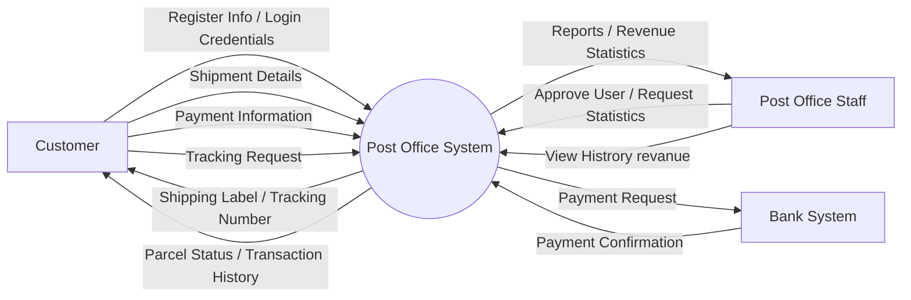
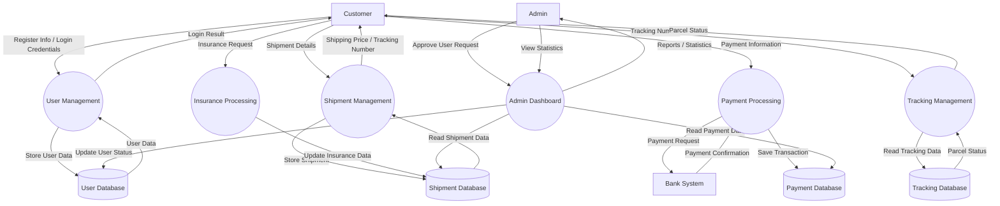

# C4 DIAGRAM

## Context Diagram
%20white.svg)

## Container Diagram
### Bank System
%20white.svg)

### Post Office Management
.svg)

## Component Diagram
### Fronend/Backend
.svg)

### Shipping Service
.svg
)
### Payment Service
.svg)

### Logistic Service
.svg
)

### Tracking Store Service
.svg
)

### Office Service
.svg)

### Use Case Diagram

### Class Diagram

# DFD Diagram (Level 0)

# DFD Diagram (Level 1)

# Design Rationale – Thailand Post Office Web Application

## Overview

This document explains how each design model relates to the system requirements and how the models collectively support key design decisions, including component boundaries, responsibilities, and interactions.

---

## 1. C4 Context Diagram

### Relationship to Requirements

The Context Diagram establishes the system boundary of the **Thailand Post Office Web Application** and identifies all external actors that interact with it. Based on the requirements, three primary actors are identified:

- **Customer** – a registered user who creates shipping labels, pays for delivery, and tracks parcels.
- **Post Office Staff** – internal officers who verify customer identity and review operational reports.
- **Bank System** – an external payment infrastructure that handles PromPay transfers, credit card transactions, and e-wallet (TrueMoney) payments.

### Design Decisions Supported

The Context Diagram makes explicit that the system does **not** directly handle payment processing logic internally. By placing the **Bank System** as a distinct external actor, this boundary decision reflects the requirement that all payments must be electronic and processed through existing financial infrastructure. This reduces compliance risk and avoids building sensitive financial logic in-house.

The separation of **Customer** and **Post Office Staff** as distinct actors at this level signals that the system must support two fundamentally different user experiences and access control levels, which drives downstream design decisions in the Container and Component layers.

---

## 2. C4 Container Diagram

### Containers Identified

| Container | Responsibility |
|---|---|
| **Frontend (Web Application)** | Delivers the user interface for both customers and staff via a browser |
| **Backend (API Server)** | Handles all business logic, enforces rules, and coordinates services |
| **Post Office Management** | Internal staff dashboard for account approval and report generation |
| **Bank System (External)** | Processes all electronic payment transactions |

### Relationship to Requirements

The requirement for **99.999% uptime** and **sub-one-second page response times** drives the decision to separate the frontend and backend into distinct containers. This allows each layer to be scaled independently. The backend API can be horizontally scaled without redeploying the frontend, and static assets on the frontend can be cached at the edge.

The **Post Office Management** container is separated from the main backend to enforce a clear boundary between customer-facing functionality and internal staff operations. This supports the requirement that staff can log in to review daily, weekly, and monthly parcel volumes and revenue, and generate PDF reports — none of which should be exposed through the customer-facing API surface.

The **Bank System** container being external affirms that payment orchestration (PromPay, credit card, TrueMoney) is delegated to external providers, with the backend only responsible for initiating and confirming transactions.

### Security Rationale

The requirements explicitly demand **data encryption in transit and at rest**, and **security testing against attacks**, given that the system stores national ID card images and payment credentials. The container boundary between frontend and backend enforces all communication over HTTPS. Sensitive data such as national ID photos never flows directly from the browser to the database — it is mediated through the backend, which is responsible for encryption before storage.

---

## 3. C4 Component Diagram

### Components Identified

The backend API container is decomposed into the following components:

| Component | Responsibility |
|---|---|
| **Frontend / Backend (Core API)** | Routes requests, manages authentication and session, enforces access control |
| **Shipping Service** | Handles parcel type selection, weight input, size classification, and label generation (PDF) |
| **Payment Service** | Integrates with the Bank System to process PromPay, credit card, and e-wallet payments |
| **Logistics Service** | Determines destination location, calculates shipping price based on weight and distance |
| **Tracking Store Service** | Stores and retrieves tracking events, provides parcel status and delivery confirmation |
| **Office Service** | Serves staff-only functionality: identity verification approvals, report generation (parcel count, revenue), PDF export |

### Relationship to Requirements

**Shipping Service** directly maps to the customer workflow: selecting parcel type (small/medium/large letter, box), entering weight, and generating a PDF label with sender, recipient, and QR code. This component owns the label generation responsibility so that the QR code format and tracking number assignment are consistent.

**Payment Service** encapsulates all payment logic in one place. The requirement lists three payment methods (PromPay, credit card, TrueMoney), and isolating them in one component means that adding or updating a payment method does not affect shipping or tracking logic.

**Logistics Service** handles destination selection and price calculation. Separating this from Shipping Service reflects the single-responsibility principle — pricing logic (weight × zone rate) is distinct from label formatting and parcel registration.

**Tracking Store Service** is isolated because the requirement for parcel tracking — including showing who received the parcel — implies a high-read, append-only data pattern that benefits from a dedicated service boundary. This also makes it easier to expose a lightweight tracking API without exposing full shipping details.

**Office Service** is a distinct component because all staff functionality — account approval, report generation, and PDF export — requires a separate permission model. Keeping this isolated ensures that no customer-facing component can inadvertently expose administrative data.

### Insurance Handling

The requirement for optional insurance purchase before payment is handled at the boundary between the **Shipping Service** (which captures insurance selection and item value) and the **Payment Service** (which includes the insurance premium in the final charge). This two-component handoff reflects the fact that insurance is both a shipping attribute and a payment line item.

---

## 4. Use Case Diagram

### Relationship to Requirements

The Use Case Diagram maps each requirement to a named user action and identifies which actor (Customer or Post Office Staff) initiates it. Key use cases include:

- **Register with ID Verification** – Customer uploads national ID photo and holding photo; triggers staff approval workflow.
- **Create Shipment** – Customer selects parcel type, enters weight, selects destination, and optionally adds insurance.
- **Make Payment** – Customer pays via PromPay, credit card, or TrueMoney.
- **Download Shipping Label** – System generates and delivers a PDF label with QR code.
- **Track Parcel** – Customer checks parcel status and delivery confirmation using a tracking number.
- **Approve/Reject Account** – Staff reviews submitted ID verification and approves or rejects the customer account.
- **View Dashboard Reports** – Staff views parcel volume and revenue statistics by day, week, and month.
- **Export PDF Report** – Staff exports a formatted report for executive distribution.

### Design Decisions Supported

The Use Case Diagram makes explicit that **identity verification is a prerequisite** for all customer actions. This maps directly to the requirement that customers must be approved before logging in to use the service. The diagram clarifies that account approval is an asynchronous action performed by staff, not a self-service step — which informs the need for a pending/approved/rejected account state machine in the data model.

---

## 5. Class Diagram

### Relationship to Requirements

The Class Diagram defines the core domain entities and their relationships:

- **User** – holds personal details (name, address, email, password hash) and account status (pending, approved, rejected). Contains references to uploaded ID photos.
- **Shipment** – records parcel type, weight, sender, recipient, destination, tracking number, insurance flag, and item value.
- **Payment** – records payment method, amount, status, and timestamp. Associated with one Shipment.
- **Insurance** – optionally associated with a Shipment; records coverage amount and premium based on declared item value.
- **TrackingEvent** – records each status update (e.g., dropped off, in transit, delivered) with timestamp and location.
- **Label** – generated PDF artifact linked to a Shipment, containing QR code and address information.
- **StaffReport** – captures aggregated statistics for a date range (parcel count by type, revenue).

### Design Decisions Supported

The **User** class having an `accountStatus` field reflects the requirement that staff must approve accounts before customers can use the service. This state-based design avoids role confusion and supports the staff approval workflow.

The **Insurance** class being optional and associated with Shipment (not Payment) reflects the business rule that insurance is a shipping attribute with a computed premium — the Payment class then derives its total from Shipment + Insurance.

The **TrackingEvent** class being a separate entity (not a status field on Shipment) reflects the requirement that the system must show a full delivery history including who received the parcel, which requires an ordered event log rather than a single status value.

---

## 6. Data Flow Diagram – Level 0

### Relationship to Requirements

The Level 0 DFD (Context DFD) treats the entire system as a single process and shows the flow of data between the system and external entities:

- **Customer → System**: Registration data (name, address, ID photos), shipment details (type, weight, destination, recipient), payment information.
- **System → Customer**: Account approval status, shipping label (PDF), tracking updates, delivery confirmation.
- **Post Office Staff → System**: Account approval decisions.
- **System → Post Office Staff**: Pending account queue, report data.
- **Bank System → System**: Payment confirmation or failure status.
- **System → Bank System**: Payment requests (amount, method, reference).

### Design Decisions Supported

The Level 0 DFD validates that the system acts as the central broker between customers, staff, and the bank. It confirms that no direct data flow exists between the customer and the bank — all payment data is mediated through the system, which is consistent with the security requirement to encrypt data in transit and protect sensitive payment credentials.

---

## 7. Data Flow Diagram – Level 1

### Relationship to Requirements

The Level 1 DFD decomposes the system into its major internal processes, corresponding closely to the component model:

1. **Identity Verification Process** – receives ID photo uploads from customers, stores them securely, and exposes them to the staff approval queue.
2. **Shipment Creation Process** – takes parcel details from the customer, applies pricing rules from the Logistics data store, and creates a shipment record.
3. **Payment Processing** – sends payment requests to the Bank System, receives confirmation, and updates the shipment status.
4. **Label Generation Process** – reads confirmed shipment data, generates a PDF label with QR code, and delivers it to the customer.
5. **Tracking Process** – reads and writes tracking events to the Tracking Store and returns status to the customer on request.
6. **Reporting Process** – reads shipment and payment records, aggregates statistics, and returns formatted reports to staff.

### Design Decisions Supported

The Level 1 DFD makes data stores explicit: **User Store**, **Shipment Store**, **Tracking Store**, and **Report Store**. This granularity supports the requirement for data encryption at rest by identifying precisely which stores contain sensitive data (User Store for ID photos and credentials; Shipment Store for payment details).

The **Label Generation Process** being separate from **Payment Processing** in the Level 1 DFD reflects the design decision that label generation is triggered only after a payment confirmation is received. This prevents customers from downloading labels before a successful payment, which is an important business rule embedded in the process ordering.

---

## Summary of Key Design Decisions

| Decision | Justification |
|---|---|
| Separate staff and customer surfaces | Different permission models and workflows; prevents data leakage |
| Delegate payment to external Bank System | Compliance, security, and reduced in-house liability |
| Isolate Tracking Store Service | High-read pattern; decoupled from write-heavy Shipping Service |
| Account state machine (pending/approved/rejected) | Required by ID verification and staff approval workflow |
| Insurance as a Shipment attribute | Business rule: coverage is a shipping concern, not a payment concern |
| Label generated post-payment confirmation | Prevents label access before valid payment |
| Encrypt User Store and Shipment Store | Contains national ID images, credit card data, and personal information |

